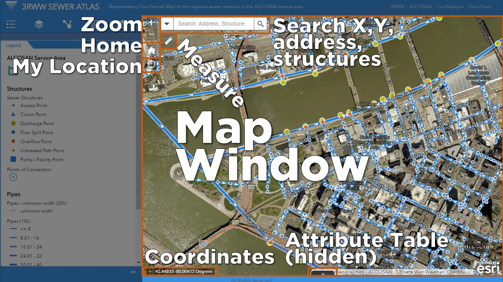
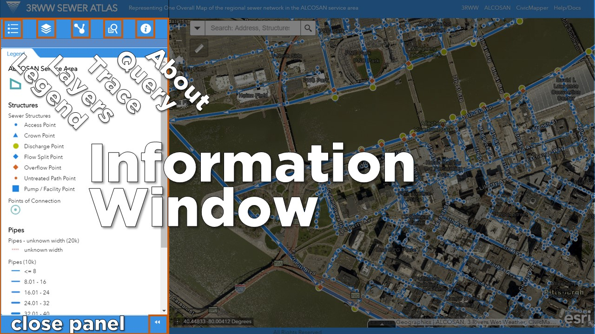
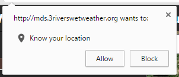
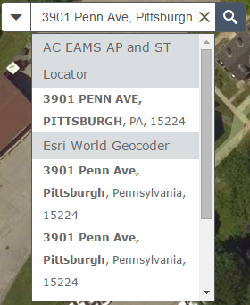
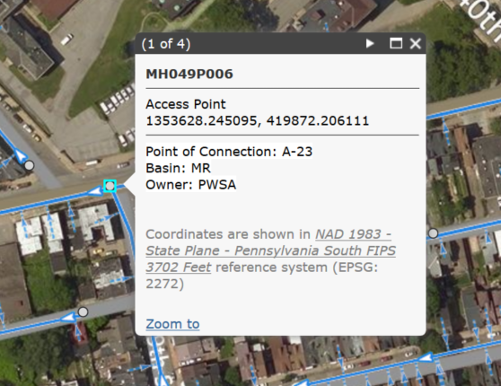
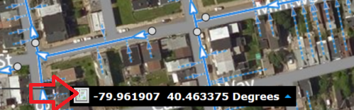
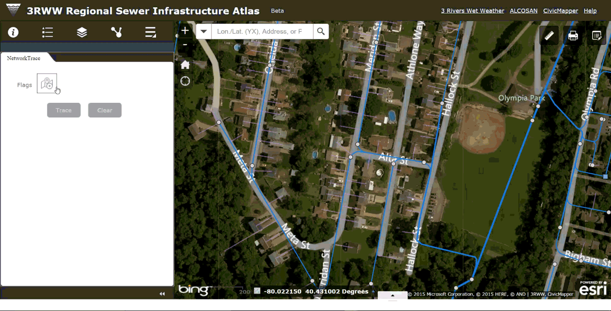

# 3RWW Sewer Atlas:  **Discharge Tracing Guide**

**

This user guide describes how to use the 3RWW Sewer Atlas in desktop and field workflows for identifying potential discharges into the sewer system. With this guide, users will learn to:

1. find the location of interest on the map
2. identify wastewater infrastructure on the map
3. trace upstream from the nearest infrastructure
4. use available reference map layers to help identify potential discharge sources

## The Atlas Interface

 The Atlas is comprised of two parts:

### Map Window

*For more information on the Map Window, see the complete [help documentation](help_rsi_ui.md#map-window).*

### Information Window

The steps in this guide refer to widgets contained in the Map and Information windows.

# **Step 1. Get to your location of interest on the map**

To move the map to your current location, you can use one of several methods:

## Method 1: Use the **My Location** widget
*...when using mobile devices in the field*

**

The **My Location** button will automatically map ***your physical location***. This is useful if you are using a mobile device in the field, and need to quickly figure out what infrastructure is nearby your location.

*Note: this works only if your web  browser and/or device has the necessary geo-location capabilities enabled. These capabilities vary by device; tablets and smartphones typically have this capability. The web browser on your device may prompt you to allow the Sewer Atlas to access your device's location:*

**

*By selecting **Allow**, the Atlas will shift the map to your location.*

## Method 2: Enter the address

If you have the address of complaint, you can enter it into the The [Search widget](help_rsi_tasks.md#searching-for-locations), located in the upper left hand corner of the map window.

* In the Search Widget, enter the address as: `street-number street-name, city, state (optional) zip code (optional).`
	* For example, you would enter the address for 3 Rivers Wet Weather as `3901 Penn Avenue, Pittsburgh, PA 15224`
* Click the *Search* Button (the magnifying glass icon).
* A dropdown will appear with search results:

	**

## Method 3: Enter the Wastewater Structure ID

If the ID for the wastewater structure related to the complaint is known, such as for a manhole or outfall, you can enter that into the search bar instead of the address.

The [Search widget](help_rsi_tasks.md#searching-for-locations) located in the upper left hand corner of the map window also allows you to enter the **wastewater structure ID number**. To search by ID:

* In the Search Widget, enter the ID number. This could include, for example:
	* manhole IDs: **MH049K010**
	* outfall IDs: **A-20Z**
* Click the *Search* Button (the magnifying glass icon).
* A dropdown will appear with search results:

	**

* By clicking the result in the dropdown, the map will pan and zoom to that location.
* Note that if you enter a partial ID number, the search will return related results:

	**

# **Step 2. View and Interact with Sewer Data**

Once you have found the location of interest, you may need to identify specific pieces of infrastructure nearby. There are a few ways to make sure the map allows you to see the infrastructure you're looking for.

## Wastewater Infrastructure Layers

This being a sewer infrastructure atlas, the map by default shows the key elements of the regional wastewater infrastructure: pipes, structures, and virtual laterals.

The map ***Legend*** in the **Information Window** summarizes the symbols for wastewater infrastructure features that are visible on the map. The legend will change dynamically depending on the layers shown on the map.

### Pipes
So that you may quickly get a sense of the hierarchy of the wastewater network, the pipes are shown on the map in classes by diameter in inches as follows:

**

#### Virtual Laterals

Zooming in far enough on the map will reveal *virtual laterals.* Note that virtual laterals do not represent actual pipes, but indicate likely connections from buildings to the nearest municipal pipe.

#### Flow Direction

On both Pipes and Virtual Laterals, **Arrows** indicate the direction of wastewater flow.

### Structures

Wastewater structures are points on the map, illustrated with symbols that denote general function:

**

Structures will appear at higher zoom levels.

### Get information about Wastewater Infrastructure Layers

The wastewater infrastructure data shown on the map has numerous informational attributes about the infrastructure. To see these attributes, simply click on a feature. A pop-up window will appear.

**

This window contains key attributes, such as the wastewater structure ID, the X/Y coordinates, and pipe sizes, and the ALCOSAN point of connection ID.

*Note: coordinates in the pop-up for wastewater structures are currently shown in the* **NAD 1983 - State Plane - Pennsylvania South FIPS 3702 Feet reference system (EPSG: 2272).** *This differs from the global mercator coordinates use in the search widget described above*

Text at the very top of the window will indicate if one or more features have been selected.

**

This will often happen if you select, for example, a manhole, which will have one or more pipes attached to it, or any other features in very close proximity to one another. Use the arrows on the top right side of the pop-up window to quickly cycle through the attributes of nearby infrastructure.

## Get the X/Y coordinates of a specific wastewater structure

*Note: currently the coordinates in the pop-up for wastewater structures are shown in the* **NAD 1983 - State Plane - Pennsylvania South FIPS 3702 Feet reference system (EPSG: 2272).** *This differs from the global mercator coordinates use in the search widget. While both systems are accurately used to show data on this map, a future release will provide the wastewater structure coordinates in a manner consistent with other coordinates displayed on the map*

To get the coordinates for a specific wastewater structure, use the coordinate display at the bottom of the map window.

**

The coordinates are updated based on the position of the mouse over the map. To get the coordinates for a specific location (and keep them from changing when the pointer moves):

* click the button shown to the left of the coordinates (noted in the image above with a red arrow).
* click the location on the map (such as on the wastewater structure) that you need the coordinates for.

The coordinates will remain until the user clicks on the map again, or toggles the button.

# **Step 3. Trace the Sewer Network**

**

Now that you have found your location of interest and identified the sewer infrastructure you are interested in, you can begin to figure out where possible illicit discharges might be coming from by tracing the sewer network. The ***Network Trace*** widget automates this analysis for you.
   

1. Open the ***Network Trace*** widget in the **Information Window**.

	**

2. Click the `Flag` button in the widget, and then click on the map on top of the infrastructure at the location from which you want to trace. You will likely want to place the flag directly on the manhole or other structure from which you are conducting the analysis, but the trace can run from any location on the pipe.

	**

	*Note that the flag you place will be automatically snapped to the nearest pipe or structure for the analysis, so it is OK if you don't place it precisely!*

3. In the widget window, click the `Trace` button, and the analysis will start. Depending on how many pipes are traced, the analysis may take anywhere from a few seconds to a minute or two to complete.

	You can continue to do other things with Atlas, such as pan and zoom or turn layers on and off, while the trace analysis runs.

	When the analysis is complete, the results of the trace are added to the map.

	**

	* **upstream pipes** are highlighted in orange
	* **upstream structures** are highlighted in orange
	* **downstream pipes** are highlighted in green
	* **downstream structures** structures are highlighted in green

	 As with the wastewater structure layers, you can click on the trace results on the map to view attributes of the infrastructure.

4. By clicking the `Clear` button in the widget, the network trace results and any `Flag` inputs will be removed from the map.

# **Step 4. Identify sample points upstream**

Once you can see results of the trace on the map, you can go back and use available layers to help identify potential sample points and discharge sources.

## Upstream wastewater structures and pipes

Once you've completed a trace, **upstream pipes** and **upstream structures** will be shown on the map highlighted in orange. You can click on the orange pipes and orange structure to get the same pop-up information you could see without the trace, as described above.

## Virtual Laterals

Even though **Virtual laterals** are not traced with the network trace widget, use them in conjunction with the orange upstream trace results as a visual reference, to help identify possible discharge sources. Virtual laterals are mapped from the center of buildings.

# **Step 5. Printing**

Instead of taking screenshots to capture the current map view, using the ***Print*** widget. This widget allows you to "print" your current map view direct to a `.pdf` file or one of several image file formats, with the added benefit of providing a complete map layout with legend, scale, and title. By default the widget will generate an 8.5 x 11 inch `.pdf` map.

To print:

* simply adjust the view of the map to the view you would like to save.
* select

The print window includes an advanced options button that allows the user to customize the map title, author, image resolution, and other details.

**

The print job is sent to a remote server, and may take some time to complete. You can use the rest of the Atlas while waiting - the job will complete in the background and notify you when ready.

# Supporting Functionality

## The Base Map and other supplementary map data

By default, imagery from **Allegheny** County with streets and points of interest from **Esri** is displayed with the wastewater network data.

## Other reference layers

Clicking the **Map Layers** widget in the **Information Window** displays all layers available to be  shown on the map. These can individually be turned on or off; transparency can also be adjusted.

**
