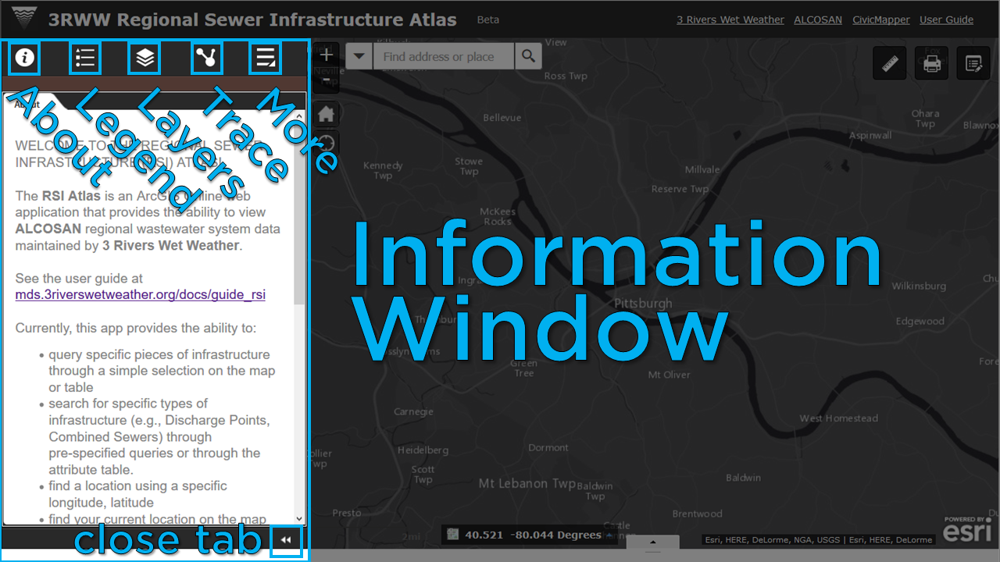

# 3RWW Sewer Atlas:  **General Help Documentation**

*Note: this documentation is in active development*

The 3RWW Sewer Atlas is a modern, mobile-friendly web application built on Esri ArcGIS technology that provides access and interactivity with regional sewer network geodata.

For a video overview, watch our [November 2015 Sewer Atlas webinar on Youtube](https://www.youtube.com/watch?v=UO1S4CFOxdI).

This help documentation describes:

1. the elements and tools of the application's [**Interface**](help_rsi.md#1-interface), which are referred to as *widgets*; and,
2. [**Common Tasks**](help_rsi.md#2-common-tasks) that the user might need to execute, such as turning layers on and off or tracing the regional sewer network.

___
# 1. Interface

*Above: the Sewer Atlas interface*

The application's interface is comprised of two main components:

* **Map Window:** The right side of the interface displays the map. Tools for navigating and interacting with the map and data overlay the map.

* **Information Window:** The left side of the interface displays information about the map or widgets used to interact with the data. The Information Window can be collapsed by clicking the close arrows ("<<") at the bottom of the window.

## Map Window

*Above: elements of the the Sewer Atlas interface Map Window*

By default, drag the map to pan; use a scroll wheel if available to zoom.
Clicking on wastewater pipes and structures will reveal a pop-up window containing more information about the infrastructure.

Three buttons located in the top left corner of the map window provide additional control:

* **Zoom** buttons zoom the map near and far.

* The **Home** button resets the map to its inital zoom and location

* The **My Location** button will set the map to your location, if your browser and/or device has the necessary geo-location capabilities enabled. These capabilities vary by device.

Adjacent to the **Zoom**, **Home**, and **My Location** buttons is a **Search Box**. See [Searching for Locations](help_rsi.md#searching-for-locations) for mor information.

Two widgets are located at the bottom of the window:

* the coordinates of the map cursor, reported as longitude and latitude (X and Y) in decimal degrees. See [Identifying Coordinates](help_rsi.md#identifying-coordinates) for more information.

* a tab, which when clicked will reveal the **Attribute Table**. See [Using the Attribute Table](help_rsi.md#using-the-attribute-table) for more information.

Three widgets are located in the top-right corner of the map window:

### *Measure*

This widget allows you to quickly measure distance and/or area on the map. Select the `Area` or `Distance` button in the widget, and then click on the map at desired locations. The length or area of the drawing will be displayed in the widget.

This tool will also identify the longitude and latitude (X and Y) of a point placed on the map. See [Identifying Coordinates](help_rsi.md#identifying-coordinates) for more information.

### *Print*

This widget allows you to print your current map view to a `.pdf` or one of several image formats.

### *Annotate*

This widget allows you to add annotation markers to the map and make notes. See [Adding Annotations](help_rsi.md#adding-annotations) for more information.

*NOTE: In a future release of this application, this widget will also enable direct editing of the sewer network data and will be renamed the **Editing** widget.*

## Information Window

*Above: elements of the the Sewer Atlas interface Information Window*

The left side of the screen contains a collapsible window that displays several types of information and/or options for configuring the map. Along the top of this window you can find icons for the following 'widgets':

### *About*
Provides an introduction to the application.

### *Legend*
Summarizes the symbols for features currently shown on the map. This window will change dynamically depending on the layers shown on the map.

### *Map Layers*
Shows all data layers available for viewing on the map, and allows the user to select layers See [Changing Map Layers](help_rsi.md#changing-map-layers) for more information.

### *Network Trace*
Opens the Network Trace tool. See [Tracing the Wastewater Network](help_rsi.md#tracing-the-wastewater-network) below for more information.

### *Select Features*
(under the **More** icon) Provides the ability to select features from the sewer data. See [Selecting/Highlighting Features](help_rsi.md#selectinghighlighting-features) for more information.

### *Summarize Features*
(under the **More** icon) Provides the ability to generate reports on the sewer data. See [Generating Summaries](help_rsi.md#generating-summaries-of-map-features) below for more information.

### *Basemap Gallery*
(under the **More** icon) Displays Available basemaps for display underneath the Map Layers. See
[Changing Basemaps](help_rsi.md#changing-basemaps) for more information.

___
# 2. Common Tasks
___
## Changing Map Layers

Clicking the **Map Layers** widget displays all layers shown on the map (except for the basemap)

A number of data layers are available for viewing on the map in addition to the sewer data. This includes

* regional flow monitoring points and their estimated catchment areas
* several map services provided by Allegheny County, which include geodata ranging from parcel boundaries to recent aerial imagery
* "Virtual laterals" to help identify the pipe to which a given parcel is linked in the wastewater network (note that improvements to this data is ongoing)

The user can opt to turn layers and sub-layers on or off as needed by clicking the `checkbox` to the right of each item.

Clicking the `down arrow` on the right side of a layer displays a context menu, which includes the following functions:

* `Zoom to`: Sets the map extent to the extent of the layer.
* `Transparency`: Sets the transparency for the layer.
* `Move up`: Moves the layer one level up.
* `Move down`: Moves the layer one level down.
* `Open attribute table`:Opens the [**Attribute Table**](help_rsi.md#using-the-attribute-table) for the feature layer. This allows the user to view all attributes for features, and provides some other filtering and export abilities described further below.
* `Description / Show Item Details`: Opens the service description or the item details page for the service or the item associated with the layer, if available. This page includes information for linking to the feature service or downloading a static version of the data in one of several spatial or non-spatial formats. The ability to download varies by data source.
___
## Changing Basemaps

Clicking the ***Basemap Gallery*** widget displays all available basemaps.

The user can optionally select the base map shown underneath the map layers. By default, this is set to a global imagery map from Esri; however, other basemap options such as 'Dark Canvas' may provide the user with higher legibility and clarity especially when printing.

Note that graphically simpler basemaps tend to have smaller tile file sizes and consequently will load faster.

Clicking one of the basemap thumbnails sets it as the active basemap for the application. Click the `x` button in the upper right corner of the Basemap Gallery window to close it.
___
## Searching for Locations

The Search widget is located in the upper left hand corner of the map; it enables end users to find locations on the map.

To search for locations, in the Search widget enter either:

* Coordinates, entered as Longitude, Latitude (i.e., *X, Y*); in Allegheny County:
	* the first coordinate will generally be between **-80.36** and **-79.69**.
	* the second coordinate will generally be between **40.67** and **40.19**.
* Addresses (e.g., 3901 Penn Avenue, Pittsburgh, PA 15224)
* Place Names (e.g., Pittsburgh)
* Wastewater Structure ID Number; this looks like, for example:
	* manhole IDs: **MH049K010**
	* outfall IDs: **A-20Z**

Once you've entered the information you want to search for, Click the *Search* Button (the magnifying glass icon). A dropdown will appear with search results.

**

Note that for Wastewater Structure IDs, entering a partial number will return similar results:

**

### Advanced Searches

By default, the Atlas will attempt to figure out what you're trying to search for, and return the relevant results. However, occassionally it won't be able to do this. In those instances, specify which database you need to search using the drop-down on the left-hand side of the search box:

**

Specifically for street addresses, the arrow on the left side of the search box allows you to use a specific geocoding service:

* *AC EAMS AP and ST Locator:* a geolocation service provided by Allegheny County, which uses up-to-date addressing maintained by the County for supporting 911 emergency service dispatching. Also supports X/Y coordinate searches.
* *Esri World Geocoder:* a geolocation service with worldwide coverage that includes place names and some points of interest; address accuracy in Allegheny County may not be as refined as the AC EAMS AP and ST Locator. Also supports X/Y coordinate searches.
* *Wastewater Structures:* this will only search the sewer structures database.
___
## Identifying Coordinates

There are two ways to quickly identify real-world coordinates in the application:

* The coordinates of the location of the mouse on the map are displayed in real-time in the bottom left-hand corner of the map window. A button to the left of these values acts as a toggle; when clicked, it allows the user to click a point on the map, and see the coordinates for that point in the lower left. The coordinates will not update until the user clicks on the map again or toggles the button.

* The ***Measurement*** widget, located in the top right corner of the map window, provides the ability to place a temporary flag on the map. The coordinates are reported for this flag in the Measurement widget window.

Note that the Sewer Atlas displays data in the WGS 1984 Web Mercator Auxilary Sphere coordinate reference system (CRS). All coordinates reported in the application are in this CRS.
___
## Using the Attribute Table

The **Attribute Table** displays a tabular view of the map data and its attributes at the bottom of the map window. It is a powerful tool for searching, selecting, sorting, and exporting data from the map.

Please note that the wastewater network contains over 125,000 features. Certain operations conducted on the entire dataset in the **Attribute Table**, such as sorting, will take time to complete.

### Opening the table
The attribute table can be opened two ways:

* clicking the arrow/tab at the bottom of the map window
* though the **Map Layers** widget in the information window, clicking the down arrow on the right side of a layer, which will open a context menu with an *Open attribute table* option.

When more than one layer's attributes display, multiple tabs automatically generate in the attribute panel allowing you to switch among the attribute tables.

### Using the table

*Clicking a record* in the table selects it and highlights the corresponding feature in the map with the color specified in the Attribute Table widget configuration window. Press the Shift or Ctrl key to select multiple records.

By *Clicking a field heading*, the table will sort the records by the field.

Buttons at the top of table help manage the selection and the way the table displays:

* An *Options* menu provides advanced selection, filtering, and exporting options. More on this later.
* *Zoom to selected:* features—Clicking Zoom to resets the map extent to center around selected features.
* *Clear selections:*—Clicking the Clear Selection button clears all selections.
* *Refresh*—Clicking Refresh refreshes the tables.
* *Show or hide columns:*—Clicking the **+** icon on the right side of the Attribute Table panel opens the field visibility window. Check or uncheck the fields to set them to visible or invisible in the table.
Number of selected records—Shown on the lower left of the table. Can also be accessed from the *Options* menu.

### Selecting and Filtering records and features

The Attribute Table provides the user to dig deep into the data and manipulate what data is shown on the map. Through the `Options menu` on the table, you can select or filter records in the table, which in turn highlights or filters, respectively, the corresponding features on the map. The available options

* *Show Selected Records:* Only displays selected records. By hiding records you haven't selected, it may be easier to visually browse the table.
* *Show Related Records:* *Note: the Sewer Atlas does not currently have related tables.* Displays related records if a selected record has related table.
* *Filter:* Allows the user to specify a query that will filter records in the table.
* *Filter by Map Extent:* This option only displays attributes in the table for features within the current map extent.

### Exporting records from the table

The `Options menu` provides an *Export to CSV* tool, which creates a file that can be opened in Microsoft Excel, other spreadsheet software, or a text editor.

If records are selected and/or a filter is applied, only the selected and/or filtered records are exported. If no records are selected or filtered, all the records are exported.

___
## Selecting/Highlighting Features

The ***Select Features*** widget displays a list of predefined queries that you can run to highlight specific features on the map and simultaneously highlight the corresponding records in the attribute table.

Two options are provided when running queries:

* `Use spatial filter`: One of two spatial filters is applied on top of the query definition.
	* `Use current map extent`: Only features falling within the current map extent and meeting the query definition return.
	* `Draw a graphic on the map`: Only features falling within the graphic and meeting the query definition return.
* `Add result as operational layer`: When this option is checked, query results remain on the map until the Clear Results button is clicked.

Selected features will also be selected in the ***Attribute Table***.

*Note: several queries have been predefined for the application to start with; these can easily be expanded/modified to meet user requirements based on available data - just ask!*
___
## Filtering Map Features
See *Using the Attribute Table >>> Selecting and Filtering records and features* for instructions on how to filter features.
___
## Generating Summaries of Map Features

The **Summarize Features** widget displays quantitative attributes from a map layer as a graphical representation of data. It is intended to makes it easier for end users to observe possible patterns and trends out of raw data.

Click on the widget, opens a list of possible summary reports to run. Select the desired report. An options window will ask if you would like apply a spatial filter (i.e., to only report on features within a specific area). Select either:

* `Only features intersecting the current map area` -- only features in the current map view will be used in the summary
* `Only features intersecting a user-defined area` -- this will prompt the user to draw an area on the map, in which an features will be summarized

Clicking `Apply` will generate a chart.

*Note: a single report has been predefined for the application to start with; this can easily be expanded/modified to meet user requirements based on available data - just ask!*
___
## Adding Annotations

The **Annotate** widget allows the user place notes on the map. Open the widget, and select the pushpin. Click on the map where you would like to make a note. A pop-up window will appear, which provides a text box for entering text.

Annotations are stored in a single map layer and have an [**Attribute Table**](help_rsi.md#using-the-attribute-table). The layer can be found in the **Map Layers** widget. From that widget, annotations can be displayed or hidden on the map.

Select any notation on the map with the Annotate widget open to edit the notes. Alternatively, the notes can be edited in the *Attribute Table*.
___
## Editing Features
*To be completed*
___
## Tracing the Wastewater Network
The **Network Trace** widget allows the user to identify upstream and downstream wastewater pipes and structures from any given point. It automatically runs both upstream and downstream traces, returning connected wastewater pipes and structures in both directions. It provides a basic summary of these features along with the ability to download the complete results.

### Tracing from a point on the network

1. Tracing is initiated from one (or more) `Flag` inputs that the user places on the map. Open the widget, click the `Flag` button, and select the desired location(s) on the map. Note that the location you pick does not need to be ultra-precise; the point you place will be automatically snapped to the nearest pipe once the trace is initiated.

2. Click `Run` and the trace will commence.

3. The results of the trace are added to the map in 4 new layers: upstream pipes, upstream structures, downstream pipes, and downstream structures. These new layers are effectively copies of the traced pipes and structures from the wastewater network dataset. Each layer is accessible in the both the **Map Layers** widget and the **Attribute Table**, and contains all attributes of the wastewater network dataset.

4. By clicking the `Clear' button, the result layers and any `Flag` inputs will be removed from the map.

### Viewing and using tracing results

The tracing results are shown in the widget window in a series of expandable tabs. The first tab provides a summary count of upstream pipes, upstream structures, downstream pipes, and downstream structures for quick reference. The tabs that follow list pipes and structures that were traced upstream and downstream. Clicking on any item will highlight the item on the map.

The results can be downloaded by clicking the `download .csv` button.

## Google Street View

*This feature is planned for a future release.*
    

___
# 3. User Guides and Webinars

Available step-by-step guides for use of the 3RWW Sewer Atlas in specific desktop and field workflows include:

* [**Discharge Tracing Guide**](guide_rsi_trace.md)
* [**Advanced Network Trace Analysis Guide**](guide_rsi_analysis.md)

Additional guides will be prepared as needed.

For a video overview, watch our [November 2015 Sewer Atlas webinar on Youtube](https://www.youtube.com/watch?v=UO1S4CFOxdI).

 
 
 

This documentation draws heavily from ArcGIS Online documentation: [Overview-Web AppBuilder for ArcGIS - Create Apps - Widget Overview](http://doc.arcgis.com/en/web-appbuilder/create-apps/widget-overview.htm). Accessed September 2015. Source documentation © Copyright 2015 Environmental Systems Research Institute, Inc.
