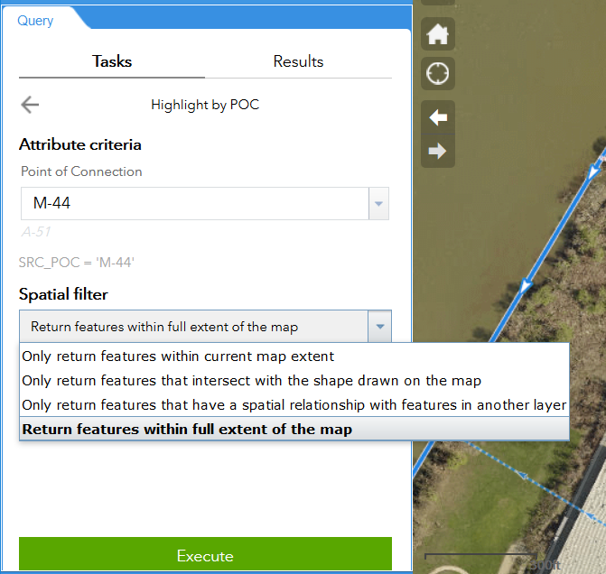
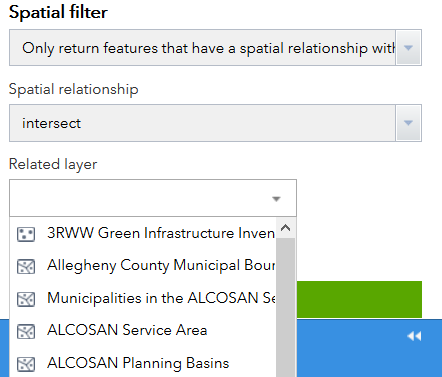
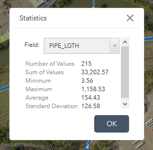

# Common Tasks

## Changing Map Layers

Clicking the **Map Layers** widget displays all layers shown on the map (except for the basemap)

A number of data layers are available for viewing on the map in addition to the sewer data. This includes

* regional flow monitoring points and their estimated catchment areas
* several map services provided by Allegheny County, which include geodata ranging from parcel boundaries to recent aerial imagery
* "Virtual laterals" to help identify the pipe to which a given parcel is linked in the wastewater network (note that improvements to this data is ongoing)

The user can opt to turn layers and sub-layers on or off as needed by clicking the `checkbox` to the right of each item.

Clicking the `down arrow` on the right side of a layer displays a context menu, which includes the following functions:

* `Zoom to`: Sets the map extent to the extent of the layer.
* `Transparency`: Sets the transparency for the layer.
* `Move up`: Moves the layer one level up.
* `Move down`: Moves the layer one level down.
* `Open attribute table`:Opens the [**Attribute Table**](help_rsi_ui.md#using-the-attribute-table) for the feature layer. This allows the user to view all attributes for features, and provides some other filtering and export abilities described further below.
* `Description / Show Item Details`: Opens the service description or the item details page for the service or the item associated with the layer, if available. This page includes information for linking to the feature service or downloading a static version of the data in one of several spatial or non-spatial formats. The ability to download varies by data source.

## Changing Basemaps

Clicking the ***Basemap Gallery*** widget displays all available basemaps.

The user can optionally select the base map shown underneath the map layers. By default, this is set to a high-resolution imagery map from Allegheny County with a reference layer from Esri; however, other basemap options such as 'Dark Canvas' may provide the user with higher legibility and clarity, especially when printing.

Note that graphically simpler basemaps tend to have smaller tile file sizes and consequently will load faster.

Clicking one of the basemap thumbnails sets it as the active basemap for the application. Click the `x` button in the upper right corner of the Basemap Gallery window to close it.

## Searching for Locations

The Search widget is located in the upper left hand corner of the map; it enables end users to find locations on the map.

To search for locations, in the Search widget enter either:

* Coordinates, entered as Longitude, Latitude (i.e., *X, Y*); in Allegheny County:
	* the first coordinate will generally be between **-80.36** and **-79.69**.
	* the second coordinate will generally be between **40.67** and **40.19**.
* Addresses (e.g., 3901 Penn Avenue, Pittsburgh, PA 15224)
* Place Names (e.g., Pittsburgh)
* Wastewater Structure ID Number; this looks like, for example:
	* manhole IDs: **MH049K010**
	* outfall IDs: **A-20Z**
* Municipalities in the ALCOSAN service area

Once you've entered the information you want to search for, Click the *Search* Button (the magnifying glass icon). A dropdown will appear with search results.

**

Note that for Wastewater Structure IDs, entering a partial number will return similar results:

**

### Advanced Searches

By default, the Atlas will attempt to figure out what you're trying to search for, and return the relevant results. However, occassionally it won't be able to do this. In those instances, specify which database you need to search using the drop-down on the left-hand side of the search box:

**

Specifically for street addresses, the arrow on the left side of the search box allows you to specify which service you want to search.

## Identifying Coordinates

There are two ways to quickly identify real-world coordinates in the application:

* The coordinates of the location of the mouse on the map are displayed in real-time in the bottom left-hand corner of the map window. A button to the left of these values acts as a toggle; when clicked, it allows the user to click a point on the map, and see the coordinates for that point in the lower left. The coordinates will not update until the user clicks on the map again or toggles the button.

* The ***Measurement*** widget, located in the top right corner of the map window, provides the ability to place a temporary flag on the map. The coordinates are reported for this flag in the Measurement widget window.

Note that the Sewer Atlas displays data in the WGS 1984 Web Mercator Auxilary Sphere coordinate reference system (CRS). All coordinates reported in the application are in this CRS.

## Using the Attribute Table

The **Attribute Table** displays a tabular view of the map data and its attributes at the bottom of the map window. It is a powerful tool for searching, selecting, sorting, and exporting data from the map.

Please note that the wastewater network contains over 125,000 features. Certain operations conducted on the entire dataset in the **Attribute Table**, such as sorting, will take time to complete.

### Opening the table
The attribute table can be opened two ways:

* clicking the arrow/tab at the bottom of the map window
* though the **Map Layers** widget in the information window, clicking the down arrow on the right side of a layer, which will open a context menu with an *Open attribute table* option.

When more than one layer's attributes display, multiple tabs automatically generate in the attribute panel allowing you to switch among the attribute tables.

### Using the table

*Clicking a record* in the table selects it and highlights the corresponding feature in the map with the color specified in the Attribute Table widget configuration window. Press the Shift or Ctrl key to select multiple records.

By *Clicking a field heading*, the table will sort the records by the field.

Buttons at the top of table help manage the selection and the way the table displays:

* An *Options* menu provides advanced selection, filtering, and exporting options. More on this later.
* *Zoom to selected:* features—Clicking Zoom to resets the map extent to center around selected features.
* *Clear selections:*—Clicking the Clear Selection button clears all selections.
* *Refresh*—Clicking Refresh refreshes the tables.
* *Show or hide columns:*—Clicking the **+** icon on the right side of the Attribute Table panel opens the field visibility window. Check or uncheck the fields to set them to visible or invisible in the table.
Number of selected records—Shown on the lower left of the table. Can also be accessed from the *Options* menu.

### Selecting and Filtering records and features

The Attribute Table provides the user to dig deep into the data and manipulate what data is shown on the map. Through the `Options menu` on the table, you can select or filter records in the table, which in turn highlights or filters, respectively, the corresponding features on the map. The available options

* *Show Selected Records:* Only displays selected records. By hiding records you haven't selected, it may be easier to visually browse the table.
* *Show Related Records:* *Note: the Sewer Atlas does not currently have related tables.* Displays related records if a selected record has related table.
* *Filter:* Allows the user to specify a query that will filter records in the table.
* *Filter by Map Extent:* This option only displays attributes in the table for features within the current map extent.

### Exporting records from the table

The `Options menu` provides an *Export to CSV* tool, which creates a file that can be opened in Microsoft Excel, other spreadsheet software, or a text editor.

If records are selected and/or a filter is applied, only the selected and/or filtered records are exported. If no records are selected or filtered, all the records are exported.

## Querying Features

The ***Query*** widget provides a way to run predefined and custom queries to highlight specific features on the map--these features can then be summarized and exported in multiple formats.

Currently, two predefined queries are setup:

* Highlight by Point of Connection (POC)
* Highlight by Owner

*Note: these can easily be expanded/modified to meet user requirements based on available data - just ask!*

Selecting one of these options in the Query window will take you to an  options screen, where you are presented with two options: **Attribute criteria** and **Spatial Filter**. Minimally, you need to select an attribute criterion, and leave the spatial filter set to its default option.

**

### Attribute criteria

This lets you select the attribute you are looking for. For POC, this is the POC code (e.g., M-44); For Owner, it is the owner name.

You can enter text--it will attempt to guess what you're looking for--or use the drop-down to select available values to search for.

### Spatial Filter (optional)

This lets you pick a way to spatially filter the data returned by the selected attribute criteria.

* `Return features within full extent of the map` (Default): All features meeting attribute criteria will be returned, regardless of whether you can see them currently in the map window.
* `Only return features within current map extent`: Returns only features meeting the attribute criteria that you can see within the map window currently. 
* `Only return features that intersect with shape drawn on the map`: This lets you draw a polygon on the map. Only features that meet your attribute criteria and intersect that polygon will be returned.

    **

* `Only return features that have a spatial relationship with features in another layer` (under development): Similiar to the drawing option above, this lets you use another feature in addition to your attribute criteria to select features. The difference here is that it takes a feature you have selected from another layer. For example, you could select a sewershed in the sewersheds layer, specify that layer here, and it will be used to narrow the query results.

    **

### Running and Query and Using the Results

Once you've set up the query options, hit the **Execute** button.

**

A list of pipes selected in the query will appear in the info window. Clicking on one of the list items will focus the map on that pipe.

At the top right of the results is a ". . .' button. This provides further options for using the results. Of note:

* `Export to CSV` file: exports results as a table, for use in spreadsheet programs
* `Export to Feature Colletion`: exports results as a `GeoJSON` file, for use on a web map
* `Export to Shapefile`: exports results as a shapefile, which is is used
in GIS and CAD software.
* `Statistics...`: Performs basic statistics (e.g., sum, average, etc.) on the queried features. By default this is performed using the *length* field.

**

* `View in Attribute Table`: Creates a view of just the queried records and select fields in the **Attribute Table**.

## Filtering Map Features
See *Using the Attribute Table >>> Selecting and Filtering records and features* for instructions on how to filter features.

## Tracing the Wastewater Network
The **Network Trace** widget allows the user to identify upstream and downstream wastewater pipes and structures from any given point. It automatically runs both upstream and downstream traces, returning connected wastewater pipes and structures in both directions. It provides a basic summary of these features along with the ability to download the complete results.

### Tracing from a point on the network

1. Tracing is initiated from one (or more) `Flag` inputs that the user places on the map. Open the widget, click the `Flag` button, and select the desired location(s) on the map. Note that the location you pick does not need to be ultra-precise; the point you place will be automatically snapped to the nearest pipe once the trace is initiated.

2. Click `Run` and the trace will commence.

3. The results of the trace are added to the map in 4 new layers: upstream pipes, upstream structures, downstream pipes, and downstream structures. These new layers are effectively copies of the traced pipes and structures from the wastewater network dataset. Each layer is accessible in the both the **Map Layers** widget and the **Attribute Table**, and contains all attributes of the wastewater network dataset.

4. By clicking the `Clear' button, the result layers and any `Flag` inputs will be removed from the map.

### Viewing and using tracing results

The tracing results are shown in the widget window in a series of expandable tabs. The first tab provides a summary count of upstream pipes, upstream structures, downstream pipes, and downstream structures for quick reference. The tabs that follow list pipes and structures that were traced upstream and downstream. Clicking on any item will highlight the item on the map.

The results can be downloaded by clicking the `download .csv` button.

 
 
 

This documentation draws heavily from ArcGIS Online documentation: [Overview-Web AppBuilder for ArcGIS - Create Apps - Widget Overview](http://doc.arcgis.com/en/web-appbuilder/create-apps/widget-overview.htm). Accessed September 2015. Source documentation © Copyright 2015 Environmental Systems Research Institute, Inc.
